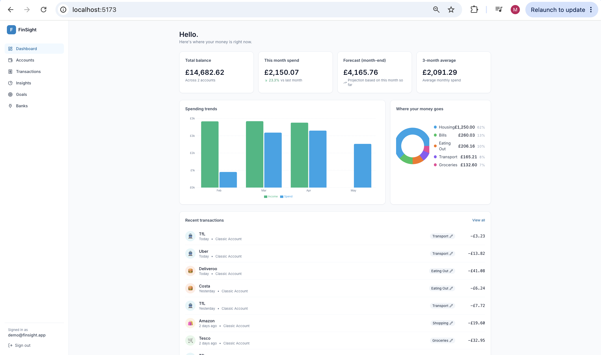
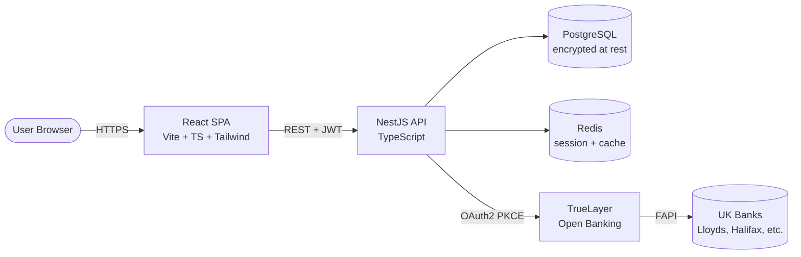

<div align="center">

# FinSight

**An Open Banking personal finance dashboard for UK consumers.**

Aggregate balances and transactions across multiple banks, auto-categorise spending, set savings goals, and surface "where did my money actually go?" insights - all built on the UK Open Banking standard via TrueLayer.

[](https://github.com/Mulualem03/finsight/actions/workflows/ci.yml)
[](https://github.com/Mulualem03/finsight/actions/workflows/codeql.yml)
[](./LICENSE)

</div>

---

## Why this project

UK retail banks - Lloyds, Halifax, Monzo, Starling, et al. - are competing on the *intelligence* layer on top of accounts, not the accounts themselves. Money Manager-style features inside the Lloyds app are exactly the kind of product surface a full-stack engineer there would build and maintain.

FinSight is a working reference implementation of that surface, built from scratch to demonstrate:

- **PSD2 / Open Banking integration** with OAuth2 + PKCE
- **Secure handling of sensitive financial data** (encrypted token storage, threat-modelled API surface)
- **Clean service-oriented architecture** with a swappable provider abstraction
- **Production engineering practices** - typed end-to-end, tested, containerised, CI'd

---

## Screenshots

> Add screenshots to `docs/screenshots/` and reference them here once the UI is running.

| Dashboard | Transactions | Insights |
|-----------|--------------|----------|
|  |  |  |

---

## Architecture



**Layered backend** (Nest modules):

```
Controllers  ──►  Services  ──►  Repositories (Prisma)  ──►  PostgreSQL
                       │
                       └─►  OpenBankingProvider (TrueLayer | Mock)
```

See [docs/ARCHITECTURE.md](./docs/ARCHITECTURE.md) for the detailed design, including the provider-abstraction rationale, token-refresh strategy, and categorisation pipeline.

---

## Features

### Implemented

- 🔐 **Authentication** - email/password with bcrypt, short-lived JWT access tokens + rotating refresh tokens
- 🏦 **Bank connection** - Open Banking OAuth2 + PKCE flow via TrueLayer (sandbox)
- 💷 **Multi-account aggregation** - current accounts, savings, credit cards across multiple providers
- 📜 **Transaction sync** - incremental pull with deduplication on provider transaction IDs
- 🏷️ **Auto-categorisation** - deterministic rules engine over merchant + MCC + description, with manual override
- 📊 **Insights** - monthly spend by category, month-on-month deltas, end-of-month balance forecast
- 🎯 **Savings goals** - track progress against target amounts and dates
- 🛡️ **Security hardening** - Helmet, rate limiting, input validation, encrypted token-at-rest, audit logging

### Roadmap

See [docs/ROADMAP.md](./docs/ROADMAP.md). Next up: ML-based categorisation, subscription detection, and a carbon-footprint overlay.

---

## Tech stack & rationale

| Layer | Choice | Why |
|-------|--------|-----|
| Frontend framework | **React 18 + Vite** | Industry default; Vite gives sub-second HMR vs. CRA's seconds |
| Type system | **TypeScript** end-to-end | Shared DTO types via a generated OpenAPI client eliminate a class of bugs |
| Styling | **TailwindCSS** | Utility-first scales better than component libraries for a custom dashboard UI |
| Data fetching | **TanStack Query** | Caching, refetch, optimistic updates - solved properly |
| Charts | **Recharts** | Composable, accessible, good defaults |
| Backend framework | **NestJS** | Opinionated module/DI structure mirrors how Spring Boot teams (i.e. Lloyds) think |
| ORM | **Prisma** | Typed queries, ergonomic migrations, strong escape hatch via raw SQL |
| Database | **PostgreSQL 16** | ACID, rich types (jsonb for raw provider payloads), industry standard |
| Cache / sessions | **Redis 7** | Refresh-token revocation lists, rate-limit counters, transaction-sync locks |
| Auth | **Passport (JWT)** | Standard; access tokens 15 min, refresh tokens 7 days, rotated on use |
| Open Banking | **TrueLayer** sandbox | UK-first, free tier, FCA-regulated AISP - most realistic dev experience |
| Validation | **class-validator + Zod (FE)** | Defence in depth at every layer boundary |
| Testing | **Jest + Supertest + Vitest + Playwright** | Unit, integration, E2E |
| Containerisation | **Docker + Compose** | One command from `git clone` to running |
| CI | **GitHub Actions + CodeQL** | Lint, type-check, test, security scan on every PR |

---

## Getting started

### Prerequisites

- Docker Desktop ≥ 24
- Node.js ≥ 20 (only if running outside Docker)
- A free [TrueLayer sandbox account](https://console.truelayer.com/) - or skip and use the built-in mock provider

### Run the whole stack

```bash
git clone https://github.com/Mulualem03/finsight.git
cd finsight
cp backend/.env.example backend/.env
cp frontend/.env.example frontend/.env
docker compose up --build
```

That gives you:

- Frontend on http://localhost:5173
- Backend API on http://localhost:3000/api
- Swagger docs on http://localhost:3000/api/docs
- Postgres on `localhost:5432` (user `finsight`, password `finsight`)
- Redis on `localhost:6379`

The mock Open Banking provider is enabled by default (`OPEN_BANKING_PROVIDER=mock`) so you can demo the full flow without TrueLayer credentials. Set it to `truelayer` and fill in `TRUELAYER_*` env vars to hit the sandbox.

### Run pieces individually

```bash
# Backend
cd backend
npm install
npx prisma migrate dev
npm run start:dev

# Frontend (new terminal)
cd frontend
npm install
npm run dev
```

### Seed data

```bash
cd backend
npm run db:seed   # creates a demo user with realistic 3-month transaction history
```

Login as `demo@finsight.app` / `Demo1234!` to explore.

---

## Testing

```bash
cd backend
npm run test            # unit tests (Jest)
npm run test:e2e        # integration tests against a real Postgres in CI

cd ../frontend
npm run test            # component tests (Vitest + Testing Library)
npm run test:e2e        # Playwright against the running stack
```

Coverage thresholds are enforced in CI: 80% lines/branches on backend business logic, 70% on frontend.

---

## Security

This is a financial application, so security is documented as a first-class concern.

- **Threat model:** [docs/THREAT_MODEL.md](./docs/THREAT_MODEL.md) - STRIDE-based, walks through the OAuth flow, token storage, and API surface
- **Headers:** Helmet with strict CSP, HSTS, frame-ancestors
- **Rate limiting:** Redis-backed, stricter on auth endpoints
- **Token storage:** Open Banking access/refresh tokens encrypted at rest using AES-256-GCM, key sourced from env (production: KMS)
- **PII minimisation:** Only data needed for product features is persisted; raw provider payloads are stored in `jsonb` for replay during development and purged in production
- **Dependency hygiene:** Renovate config, `npm audit` in CI, CodeQL scanning

Found a security issue? See [SECURITY.md](./SECURITY.md).

---

## Project layout

```
finsight/
├── backend/                # NestJS API
│   ├── prisma/             # Schema + migrations + seed
│   ├── src/
│   │   ├── auth/           # JWT + refresh + register/login
│   │   ├── open-banking/   # Provider abstraction + TrueLayer + Mock
│   │   ├── accounts/       # Aggregated account read API
│   │   ├── transactions/   # Sync, list, filter, manual recategorisation
│   │   ├── categorization/ # Rules engine
│   │   ├── insights/       # Spend breakdown, forecasts, MoM deltas
│   │   ├── goals/          # Savings goals CRUD
│   │   ├── users/
│   │   ├── health/
│   │   ├── common/         # Guards, filters, interceptors, decorators
│   │   └── config/         # Env validation
│   └── test/               # E2E specs
├── frontend/               # React SPA
│   ├── src/
│   │   ├── pages/          # Route components
│   │   ├── components/     # Reusable UI
│   │   ├── hooks/          # TanStack Query hooks per resource
│   │   ├── lib/            # API client, formatters, types
│   │   └── api/            # Generated OpenAPI client
│   └── tests/
├── docs/                   # Architecture, threat model, API, roadmap
├── .github/workflows/      # CI + CodeQL
├── docker-compose.yml
└── README.md
```

---

## What I'd do next (with more time)

A short, honest list - interviewers love this.

1. **Replace the rules engine** with a fine-tuned categorisation model. The current rules cover ~85% of real transactions; the rest need ML (FastText classifier over merchant + description is a sensible first step).
2. **Plaid as a second provider** to validate that the abstraction holds up. Currently only TrueLayer + mock implement `OpenBankingProvider`.
3. **Event-driven transaction sync** - move from polled `POST /sync` to a webhook subscription with a Kafka outbox so downstream services (insights, alerts) can react asynchronously.
4. **Pact contract tests** between frontend and backend, since the OpenAPI client only catches schema breaks, not behavioural ones.
5. **OpenTelemetry** end-to-end with traces exported to Tempo, plus a sample Grafana dashboard.
6. **WCAG 2.2 AA audit** with axe-core in CI - financial services in the UK have to meet the FCA's Consumer Duty, which leans hard on accessibility.

---

## License

MIT - see [LICENSE](./LICENSE).

> Built as a portfolio project to demonstrate full-stack engineering practices relevant to UK retail banking. Not affiliated with any bank or financial institution.
