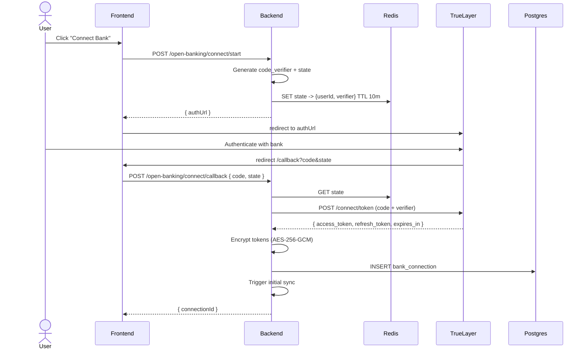

# Architecture

This document explains the *why* behind FinSight's design. The README covers *what* exists; this covers the trade-offs.

## 1. High-level shape

FinSight is a conventional three-tier app:

- A **React SPA** that talks only to its own backend
- A **NestJS API** that owns all business logic and is the only thing that talks to TrueLayer
- **PostgreSQL** for system-of-record data, **Redis** for ephemeral state

The frontend never sees TrueLayer tokens. They live server-side, encrypted at rest. This is non-negotiable for a regulated-data app: anything the browser sees is observable by malicious extensions, copy-pasted DevTools commands, or a compromised CDN.

## 2. Backend module structure

Nest's module + DI pattern was chosen specifically because it mirrors how Spring Boot applications are structured. A Lloyds engineer reviewing this should feel at home.

```
AppModule
├── ConfigModule         # Loads + validates env via class-validator
├── DatabaseModule       # PrismaService (singleton)
├── AuthModule           # Local auth + JWT issuance
├── UsersModule          # User CRUD + password ops
├── OpenBankingModule    # Provider-agnostic AISP integration
├── AccountsModule       # Aggregated account views
├── TransactionsModule   # Sync orchestration + querying
├── CategorizationModule # Pure-function rules engine
├── InsightsModule       # Read-side analytics
├── GoalsModule          # Savings goals CRUD
└── HealthModule         # /health for k8s probes
```

Each module exposes a service (business logic) and optionally a controller (HTTP boundary). Controllers do nothing except parse DTOs and call services. Services own transactions and side effects. This split is the single biggest reason Nest apps stay testable as they grow.

## 3. The OpenBankingProvider abstraction

Open Banking aggregators (TrueLayer, Plaid, Tink, Yapily) all do approximately the same thing with subtly different APIs. Hard-coding any single one in the service layer means swapping providers requires rewriting the service layer. So:

```ts
// src/open-banking/open-banking.types.ts
export interface OpenBankingProvider {
  getAuthorisationUrl(state: string, pkceChallenge: string): string;
  exchangeCode(code: string, pkceVerifier: string): Promise<TokenSet>;
  refresh(refreshToken: string): Promise<TokenSet>;
  listAccounts(accessToken: string): Promise<ProviderAccount[]>;
  listTransactions(accessToken: string, accountId: string, from: Date): Promise<ProviderTransaction[]>;
}
```

Two implementations ship:

- **`TrueLayerProvider`** - talks to the real TrueLayer Data API
- **`MockProvider`** - generates deterministic fake data with realistic merchant names, MCCs, and a Poisson-distributed transaction frequency. Used by tests, demos, and offline development.

Selection happens in `OpenBankingModule` via a factory provider keyed on `OPEN_BANKING_PROVIDER` env var. No service outside `OpenBankingModule` knows which one is active.

**Trade-off:** the abstraction is leaky around webhooks (TrueLayer pushes them, Plaid pulls; some providers do neither). For now, FinSight only supports polled sync, so the leak doesn't matter. Adding webhook-driven sync would extend the interface with an optional `subscribeToWebhooks` method and fall back to polling when absent.

## 4. OAuth2 + PKCE flow



Notes:

- **PKCE is required**, not optional, even though we have a client secret. TrueLayer's docs technically allow either, but PKCE defends against authorisation code interception on the redirect leg if a future malicious browser extension intercepts the URL.
- **State is stored in Redis with a TTL**, not in a signed cookie, because we want server-side revocation if a user starts the flow and doesn't finish.
- **Tokens are encrypted with a key from env**. In production this key would come from AWS KMS or HashiCorp Vault, and the encryption would happen at the column level via a Prisma extension or a Postgres extension like `pgcrypto`.

## 5. Transaction sync

Sync is idempotent because TrueLayer transaction IDs are stable and unique per provider+account. The sync service does:

```ts
for each connection of user:
  for each account of connection:
    fetch transactions since max(transaction.bookedAt) for that account
    upsert by (providerId, providerTransactionId)
```

`upsert by (providerId, providerTransactionId)` means re-running sync any number of times converges to the same state. This matters because:

- TrueLayer occasionally re-emits transactions with corrected merchant data
- Users can manually trigger sync, and we don't want to gate it on "is a sync already running?"
- Background sync (cron) and user-triggered sync (button click) can race without harm

A Redis lock (`SET NX EX 60`) per `(userId, connectionId)` prevents concurrent syncs from the same connection wasting TrueLayer rate-limit budget, but the *correctness* doesn't depend on the lock - it's a performance optimisation.

## 6. Categorisation

Transactions arrive from TrueLayer with a `merchant_name`, a `description`, and sometimes a `classification` array (their own MCC-derived guess). FinSight runs them through a rules engine:

```
1. Manual override? Use the user's choice.
2. Match against the user's personal rule set (e.g. "TFL.GOV.UK" → Transport).
3. Match against the global rule set (curated regexes over merchant + description).
4. Fall back to provider classification mapped to FinSight's category taxonomy.
5. Fall back to "Uncategorised".
```

Rules are pure functions and live in `categorization/rules/`. Each rule exports `{ category, match: (tx) => boolean }`. The engine evaluates them in priority order and returns the first match.

This is deliberately simple. ~85% of real transactions categorise correctly with maybe 60 rules. The remaining 15% is the long tail that ML earns its keep on - but premature ML on a small dataset just hides bugs in opaque scoring.

## 7. Insights

The insights service is a pure read-side aggregation over the transactions table. It uses Postgres-side `GROUP BY` rather than pulling rows into Node - necessary even at modest scale because a heavy user can have 10k+ transactions per year.

Forecasts use a naive approach: project the current month's spend rate forward, anchored to a 3-month rolling average of fixed costs (rent, subscriptions). It's intentionally simple and explainable; a customer can ask "why does it think I'll spend £2,400 this month?" and get a coherent answer. Replacing it with a Prophet model or similar is a future task.

## 8. Frontend data flow

The frontend uses TanStack Query as a single source of truth for server state:

- One hook per resource (`useAccounts`, `useTransactions`, `useInsights`)
- Stale-while-revalidate by default; 30s staleTime for transactions, 5m for insights
- Optimistic updates for things like manual categorisation
- Mutations invalidate the relevant query keys

There is **no global Redux store**. Local UI state lives in component state. URL query params are the source of truth for filter state (so links are shareable and the back button works).

## 9. What is intentionally out of scope

To keep the project focused, the following are deliberately not implemented:

- **Multi-currency** - UK-focused; everything is in pence (`bigint`) internally, formatted as GBP at the edge
- **Joint accounts / shared budgets** - single-user model
- **Payment initiation** (PIS) - read-only (AIS) is enough to demonstrate Open Banking competence
- **Mobile native apps** - responsive web only
- **Real KYC** - registration is email/password; a production deployment would gate access behind identity verification

Each of these is a defensible scope cut that an interviewer can probe and you can answer honestly: "I left it out because it didn't add a new technical dimension I wasn't already demonstrating elsewhere."
